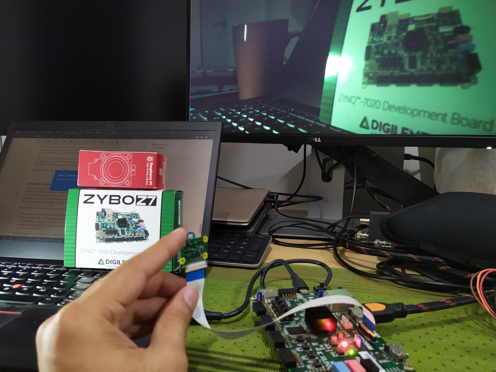
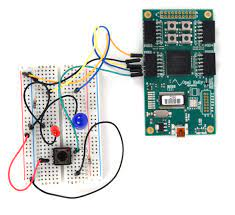

# Synchronous FIFO Memory

> system verilog synchronous FIFO memory  

Implementention in verilog of __synchronous FIFO memory__ for `device name`.  
It was implemented using ...  
The basic idea is ...  

## Get Started

The repository contains source files to be compiled with - `application name`  
The verilog source files  are located at the repository root:

- [Synchronous_FIFO_TB](./Synchronous_FIFO_TB.sv)
- [Synchronous_FIFO](./Synchronous_FIFO.sv)

If you don't know how to use it please refer to [More info here](https://sudip.ece.ubc.ca/modelsim-verilog/#:~:text=2.3%20Compile%20the%20Verilog%20file,window%20and%20the%20file%20status.)

### Burn code to FPGA

To burn the design on the FPGA:

- Connect it via USB
- blha blha
- blue green yellow

  

### Connect FPGA to external clock chip

Assemble as in the picture below:  

  

- Reset clock chip
- Reset FPGA
- Enter timer vlue using the buttons <somthing something>

## Support

I will be happy to answer any questions.  
Approach me here using GitHub Issues or at shlophkin@gmail.com  